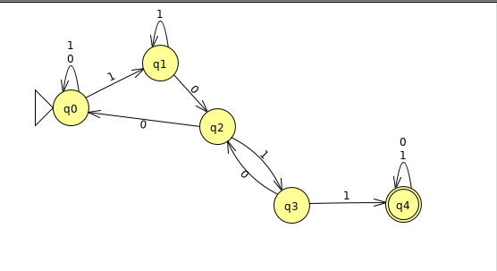

#Assignment Solution Set

## Part 1: Nondeterministic Automata

## Part 2: Deterministic Automata

Transition Table:

| State | 0  | 1  |
|:----- |:--:|:--:|
|S0     | S0 | S1 |
|S1     | S2 | S1 |
|S2     | S0 | S3 |
|S3     | S2 | S4 |
|S4     | S5 | S4 |
|S5     | S7 | S6 |
|S6     | S5 | S4 |
|S7     | S0 | S4 |

## Part 3: Larger Alphabet (Why It Doesn't Make A More Powerful Machine)
Let us compare the power of an automata using an alphabet `a0` of size `2`, the set `{0, 1}`, which we will call `m0` and an automata using an alphabet `a1` of size `n`, where `n > 2`, which we will call `m1`. Both alphabets are of finite length. A machine is considered more *powerful* if it is able to solve a problem that a less powerful machine is not able to. Thus if `m1` is able to find a solution to a particular input string that `m0` is not, `m1` is more powerful than `m0`.

First, let us look at the inputs to the automata. Since these are Finite Automata, they take in a finite input. Thus, the strings can be arbitrarily long but must be finite in length.

For contradiction, let us consider a string of length `m` made of characters from alphabet `a1`, that `m1` is able to find a solution to that `m0` is not. Since `a1` is of finite length, we can represent the entirety of alphabet `a1` as different strings of characters from `a0`. 

Thus, `m1`'s automata can be rewritten as a non-deterministic automata using the alphabet `a0` by substituting the strings consisting of letters from `a0` with the characters of `a1` in the automata. Since all non-deterministic automata can be written as a deterministic automata, `m0` is able to find a solution using the alphabet `a0`.

This leads to a contradiction, as both `m1` and `m0` are able to solve the problem. Thus, `m0` and `m1` are equally as powerful. This means that an automata using a larger alphabet does not lead to a more powerful computational machine.
