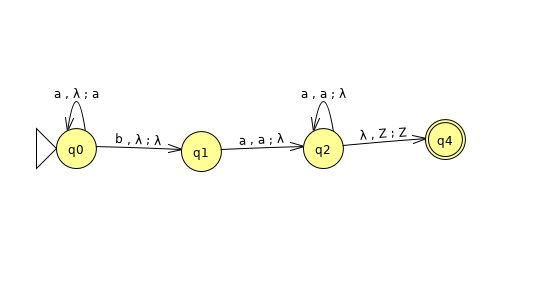

# FOCS Homework for Day 9

You may edit your answers into this file, or add a separate file in the same directory.

If you add a separate file, please include the following at the top:

```
Student Name: Byron Wasti [change to your name]
Check one:
[X] I completed this assignment without assistance or external resources.
[ ] I completed this assignment with assistance from ___
   and/or using these external resources: ___
```

## 1. For each of the following languages, decide whether it is regular

For each of the following languages, decide whether it is regular.  If it is regular, give a regular expression or finite automaton that recognizes the language.  If it is not regular, demonstrate that using the pumping lemma.

a) Strings containing only the symbol a whose length is a power of 2 (*i.e.* length 2^n)

[The strings `a`, `aa`, `aaaa`, and `aaaaaaaa` are in this language; the string `aaaaa` is not.]

Given finite automaton with _p_ states, choose word _w_ in _L_ that has property |_w_| >= _p_. Have _w_ split up as _xyz_.

Let _y_ be such that automaton has a loop on _y_. Loop _y_ extra number of times. Now |_w_| is no longer a power of 2. Automaton cannot differentiate. Therefore it is not a regular language.

b) All strings with an equal number of occurrences of the substrings `01` and `10`.

[010 is in this language; `000110` is in the language; `0101010` is in the language; but `010101` is not.]

Regular. `/(01+)*1*0/`

c) All strings (over {0,1}) consisting of a substring _w_ followed by the reverse of the substring.

[The strings `00100100` and `11110101011010101111` are in this language; the strings `00100` and `010101 `are not.]

Given finite automaton with _p_ states, choose word _w_ in _L_ that has property |_w_| >= _p_. Have _w_ split up as _xyza_ where _a_ is the reverse of _xyz_.

Let _y_ be such that automaton has a loop on _y_. Loop _y_ extra number of times. Now _a_ is no longer the reverse of _x5yz_. Automaton cannot differentiate. Therefore it is not a regular language.


## 2. Play the pumping game

Play the **pumping game** (referenced on the [Day 8 page](https://sites.google.com/site/focs16fall/in-class-exercises/day-8) and also found at [http://weitz.de/pump/](http://weitz.de/pump/)).  Solve at least two puzzles from that page (that do NOT appear in question 1, above) and provide the word you chose, the substring the computer chose, and your successfully pumped string.

Notation notes:

- The notation |w| sub a means the number of `a`'s in the word _w_.
- _a_^_n_ means _n_ occurrences of `a` (e.g. _a_^8 is `aaaaaaaa`)

If you have other questions about notation (or anything else), please post them to [Piazza](https://piazza.com) so that we can clarify for everyone.

Problem 18) `b20ab20` arbitrarily repeat first set of `b`s.

Problem 16) `a15ba15` arbitrarily repeat first set of `a`s.

## 3. Create a PDA

For one of the non-regular languages in problem 1 or 2 above, create a PDA (preferably in JFLAP) and include it with your completed homework.

For Problem 16 from the pumping game. `a^nba^n`



## 4. Reading

Optionally read Sipser pp. 101–125.

Optionally read Stuart pp. 128–134.

## 5. Install gprolog

Please download and install [gprolog](http://www.gprolog.org) before coming to class:

**Ubuntu**:

	$ sudo apt-get install gprolog

**Mac**, with [Homebrew](http://brew.sh) installed:

	$ brew install gnu-prolog

**Mac** without Homebrew, and **Windows**:

- Follow the instructions at [http://www.gprolog.org/#download](http://www.gprolog.org/#download).
